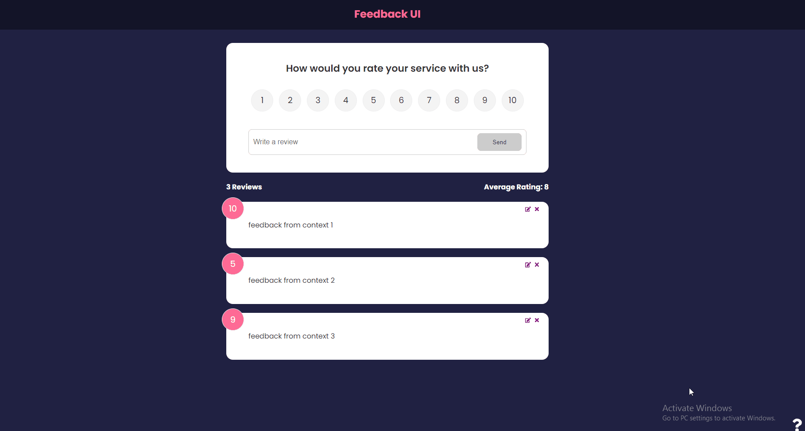

# feedback-application

front-end react application to rate a service using json server as a mock database at backend

## app UI
---

## tech stack

 - reactjs
 - json server
 - react ContextAPI
 - react routerv6

## features

 - add rating
 - delete rating
 - edit rating
 - custom form validation
 - calculate average rating and outputs to DOM

to view live [click here](https://feedbackjmr.netlify.app/).

